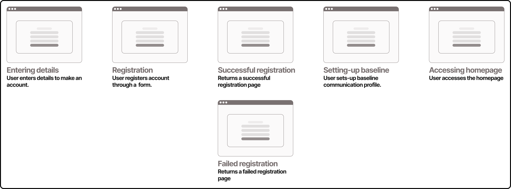

# Table of content
* [1 — Software architecture](#software-architecture)
    * [1.1 — Functional requirements](#functional-requirements)
    * [1.2 — Non-functional requirements](#non-functional-requirements)
    * [1.3 — Constraints](#constraints)

# Software architecture

## Functional requirements
### Use cases
* User registration
* User login
* User accessing a dashboard
* User creating a target vocal profile
* User starting a session
* User uploading a voice recording
* User getting real-time feedback
* User getting delayed feedback 
* Speech analysis and processing (volume, speed, pitch and pauses)

---

### Importance VS Feasability

*Include or die*
* User goal vocal profiles
* User uploading a voice recording
* User dashboard
* User wants to extract speech voice, speed, pitch and pause pattern features

*Strongly consider*
* User starting a session
* User getting delayed feedback
* User getting real-time feedback
* User login
* User registration

*Remove*
* N/A

---

### Userflows

*Registration*

*Login*

*Voice recording upload*

*Starting session*

## Non-functional requirements

### Performance

* Response time
* Throughput

---

### Scalability

* Vertical 
* Horizontal 
* Team 

---

### Availability

* Uptime
* Downtime
* Mean time between failures (MTBF)
* Mean time to recovery (MTTR)

---

### Fault tolerance

* Failure prevention
    * Spatial replication and redundancy
    * Time replication and redundancy
* Failure detection and isolation
    * Monitoring service
* Recovery
    * Automatic alerts
    * Failover 
    * Rollback
    * Restart
    * Auto-scaling
    * Stop
    * SOPs

---

### SLA, SLO, SLI

* Service-level-agreement
* Service-level-objectives
* Service-level-indicators

---

### Non-functional trade-off decisions

* Increase availability by sacrificing scalability
* Increase performance by sacrificing scalability
* Trade some performance for higher security (if necessary get some more performance by trading some availability)

---

## Constraints 

### Technical constraints

*Workstation*
* Dell T7910

*CPU*
* Intel Xeon E5-2640 v4

*RAM*
* 32Gb DDR4 ECC 24000Hz (4x8Gb)

*HDD*
* 3TB

*SSD*
* 128Gb

*GPU*
* NVIDIA GeForce GT 1030

*Tech stack*
* Java
* Springboot
* C++
* Python
* HTML
* CSS
* JS
* MySQL

*Platform*
* Web

---

### Business constraints

*Time*
* 6-Month

*Budget*
* £0

---

### Regulatory constraints

*GDPR and ethics*
* Privacy
* Transparency
* Consent
* Security
* Accountability
* Retention

---

## API design
### Public APIs
- REST

### Private APIs
- gRPC

### Partner APIs
- gRPC

### Encapsulation
### Ease of use
### Idempotency
### API pagination
### Asynchronous operations